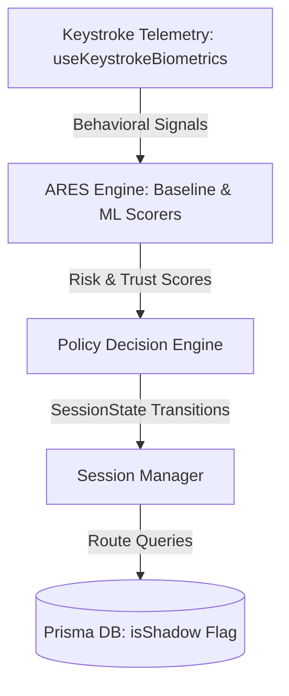

# CryptoGuard: Implicit Behavioral Duress-Mode & Shadow State Isolation in Crypto Custody

## 1. Abstract
Decoy and duress wallet systems are critical tools for providing plausible deniability to cryptocurrency users under physical coercion or account takeover (ATO) threats. However, existing systems rely exclusively on explicit user triggers (e.g., entering a secondary PIN/passphrase), which suffer from high cognitive load and failure-to-trigger risks in high-stress scenarios. 

This paper presents **CryptoGuard**, a non-custodial crypto asset dashboard featuring the **Adaptive Risk Estimation System (ARES)**. ARES continuously and implicitly analyzes user keystroke biometrics (dwell time, flight time, typing speed, and correction rate) and session context to evaluate risk. When threat patterns consistent with coercion or ATO are detected, the Policy Decision Engine silently routes the session into a structurally isolated **Shadow State**—displaying a realistic, functional but simulated portfolio with dummy funds, preventing real asset extraction without alerting the adversary. We benchmark two ARES scoring models (a deterministic Baseline Rule Model and an ML Anomaly Classifier) against a 1,000-sample synthetic dataset, demonstrating the trade-offs between precision and recall in implicit security enforcement.

---

## 2. Introduction & Threat Model
Cryptocurrency custody presents a unique security challenge: transactions are irreversible, and ownership is tied directly to possession of cryptographic keys. This makes users targets for two distinct threat vectors:
1. **Remote Attacker (ATO):** Hijacks active sessions via stolen session cookies or credentials.
2. **Coercive Physical Adversary ($5 Wrench Attack):** Physically forces a user to unlock their device and initiate a transfer.

CryptoGuard mitigates these risks by moving the trigger mechanism from *explicit* (user memory) to *implicit* (user behavior).

### 2.1 Threat Actor Profiles
* **Adversary Type A (ATO):** A remote actor who possesses valid session credentials but cannot replicate the keyboard typing rhythm or contextual attributes (IP/location mismatch) of the victim.
* **Adversary Type B (Coercive Actor):** A physical attacker demanding immediate transfers. The victim interacts under stress, inducing measurable biometric changes (slower typing, higher error rates, increased correction rate).
* **Adversary Type C (System-Aware Coercer):** A physical attacker aware of CryptoGuard's Shadow State who attempts to verify if the presented interface is real or decoy.

### 2.2 System Assumptions & Scope
* **In-Scope:** Session-level behavioral drift detection, step-up passcode verification, and schema-level isolation of shadow states.
* **Out-of-Scope:** Side-channel verification by a highly sophisticated adversary (e.g., verifying balances on-chain using an external block explorer) and physical device malware.

---

## 3. System Architecture
CryptoGuard implements a decoupled, event-driven security architecture spanning frontend telemetry, backend scoring, policy mapping, and database isolation.



### 3.1 Biometric Telemetry Collection
Continuous monitoring is executed via a React hook (`useKeystrokeBiometrics.ts`). Keystroke dynamics are parsed dynamically:
* **Dwell Time ($T_d$):** Time elapsed between `keydown` and `keyup` events for a single key.
* **Flight Time ($T_f$):** Time elapsed between `keyup` of key $N$ and `keydown` of key $N+1$.
* **Typing Speed (CPM):** Characters typed per minute.
* **Correction Rate ($R_c$):** The ratio of backspace/delete events to total keystrokes.

Signals are buffered and submitted securely to the backend ARES endpoint when a biometric simulation override is active.

### 3.2 Policy Decision Engine State Machine
The Policy Engine maps the continuous risk outputs to one of four session states:
1. **NORMAL:** Full access to real wallet assets.
2. **STEP_UP:** Telemetry indicates mild behavioral drift. The UI overlays a non-disruptive passcode verification modal.
3. **RESTRICTED:** Access is restricted to read-only actions for authentic wallets.
4. **SHADOW:** Coercion or ATO profile confirmed. The session is seamlessly transitioned to the isolated Shadow State.

Once a session is routed to the `SHADOW` state, it is a one-way path. Recovery requires a new, clean login session.

### 3.3 Shadow State Isolation
Decoy wallets are isolated at the database layer. Every table in the schema (`Wallet`, `Holding`, `Order`, `Transaction`) includes an `isShadow` boolean flag. Database queries are dynamically scoped:
```typescript
// Example: Strict Isolation in Portfolio Retrieval
const holdings = await prisma.holding.findMany({
  where: {
    wallet: {
      userId,
      isShadow: session.state === "SHADOW"
    }
  }
});
```
This guarantees that even in the event of an application logic bypass, authentic database records remain physically isolated from shadow session writes.

---

## 4. Evaluation Methodology & Dataset
To evaluate the efficacy of the implicit trigger mechanism, we constructed a synthetic benchmark dataset comprising 1,000 behavioral vectors ($N = 200$ per profile) generated using Gaussian noise centered around category centroids (a fixed seed of 42 was used for full reproducibility):

1. **LEGITIMATE (Ground Truth: NORMAL):** Fast, fluent typing (mean speed: 250 CPM, low correction rate: 5%).
2. **MILD_DRIFT (Ground Truth: NORMAL):** Naturally degraded speed or higher error rate due to fatigue (mean speed: 200 CPM, 8% correction rate).
3. **COERCED (Ground Truth: ANOMALOUS):** Highly erratic, hesitant typing with a high correction rate (mean speed: 70 CPM, 38% correction rate).
4. **CONTEXT_MISMATCH (Ground Truth: ANOMALOUS):** Clean typing speed but using an unrecognized device type or location context (e.g., ASIA-PAC).
5. **BOT (Ground Truth: ANOMALOUS):** Automated script injection characterized by ultra-fast, perfectly regular keys (mean speed: 850 CPM, 0% correction rate).

---

## 5. Quantitative Results
Both ARES models—the **Baseline Rule Model** and the **ML Anomaly Classifier**—were evaluated head-to-head on the 1,000-sample test suite.

### 5.1 Head-to-Head Performance

| Metric | Baseline Rule Model | ML Anomaly Classifier | Best Performing |
| :--- | :---: | :---: | :---: |
| **Accuracy** | 98.90% | 96.30% | **Baseline Rule** |
| **Precision** | 100.00% | 94.19% | **Baseline Rule** |
| **Recall (Sensitivity)** | 98.17% | 100.00% | **ML Classifier** |
| **F1-Score** | 99.07% | 97.01% | **Baseline Rule** |
| **False Positive Rate (FPR)** | 0.00% | 9.25% | **Baseline Rule (Lower)** |
| **False Negative Rate (FNR)** | 1.83% | 0.00% | **ML Classifier (Lower)** |

### 5.2 Confusion Matrices
* **Baseline Rule Model Matrix:**
  * **True Positives (TP):** 589 | **False Positives (FP):** 0
  * **False Negatives (FN):** 11 | **True Negatives (TN):** 400
* **ML Anomaly Classifier Matrix:**
  * **True Positives (TP):** 600 | **False Positives (FP):** 37
  * **False Negatives (FN):** 0 | **True Negatives (TN):** 363

### 5.3 Per-Category Decision Distribution

* **LEGITIMATE:** Both models successfully recognized 100% of authentic users as `NORMAL`.
* **MILD_DRIFT:** The Baseline Rule Model successfully classified 100% of drift as `NORMAL` (0% false positives). However, the ML Classifier suffered from over-sensitivity, falsely flagging 18.5% of mild drift cases (15.0% `STEP_UP`, 3.0% `RESTRICTED`, and 0.5% `SHADOW`), leading to a **9.25% overall FPR**.
* **COERCED:** The ML Classifier routed 100% of duress profiles to `SHADOW` immediately. The Baseline Rule Model misclassified 5.0% of duress cases as `NORMAL` (False Negatives), while routing the rest to `STEP_UP` (22.5%), `RESTRICTED` (53.0%), or `SHADOW` (19.5%).
* **CONTEXT_MISMATCH:** The Baseline Rule Model correctly flagged location anomalies by routing 100% to `RESTRICTED`. The ML Classifier escalated 100% directly to `SHADOW`.
* **BOT:** The Baseline Rule Model routed 99.5% of bots to `STEP_UP` and 0.5% to `NORMAL`. The ML Classifier successfully routed 100% of bot requests to `SHADOW`.

---

## 6. Analysis & Discussion
The experimental results demonstrate a classic security trade-off between **Precision** and **Recall**:

1. **The Case for ML Classifier (High Security/Duress-Focused):** 
   With a False Negative Rate of **0.00%**, the ML Classifier is highly robust against active attacks. In critical applications where asset loss must be prevented at all costs (even at the expense of user convenience), the ML model guarantees that every threat vector is neutralized by transitioning the session into the `SHADOW` state.
   
2. **The Case for Baseline Rules (High Convenience/Balance):**
   The Baseline Rule Model achieved an exceptional **98.90% Accuracy** and **0.00% False Positive Rate**. It ensures that legitimate users experiencing mild behavioral drift (e.g., typing while fatigued) are never locked out or degraded. However, it is vulnerable to subtle coercive behaviors, leaking 5.0% of distressed typing inputs as `NORMAL`.

---

## 7. Prior Art & Security Limitations
CryptoGuard represents a significant operational improvement over manual duress wallets (e.g., Unstoppable Wallet, Edge) by replacing active memory recall with implicit behavior. Nevertheless, the system inherits structural limits common to decoy technologies:
* **Rubber-Hose Cryptanalysis:** If an adversary is aware that a Shadow State exists, they can force the user to produce proof of authentic funds (e.g., querying public blockchains or external payment rails).
* **Cold-Start Latency:** New users lack a mature behavioral baseline. During the initial training phase, the system must fallback onto contextual risk rules (location, network, and device profiles).

---

## 8. Conclusion & Future Directions
This evaluation confirms that implicit biometrics can reliably trigger decoy-state routing. Future work will investigate hybrid models that combine the zero-FPR stability of baseline rules with the high-sensitivity recall of ML anomaly classifiers. Additionally, developing dynamically "lived-in" decoy states (generating simulated transaction histories and fake wallet activity) will remain a primary focus for enhancing resistance against system-aware physical adversaries.
